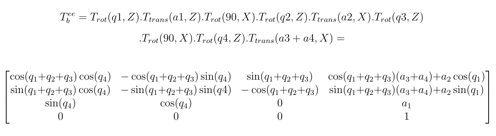
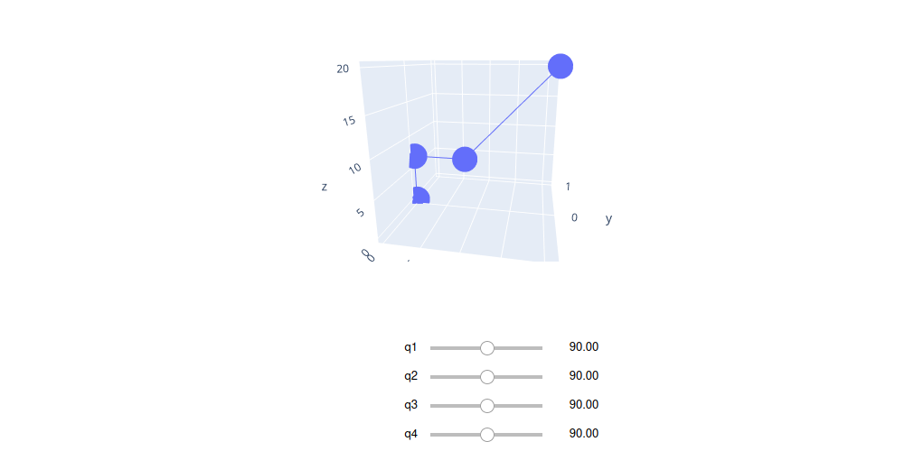

<!DOCTYPE html>
<html xmlns="http://www.w3.org/1999/xhtml" lang="" xml:lang="">
<head>
  <meta charset="utf-8" />
  <meta name="generator" content="pandoc" />
  <meta name="viewport" content="width=device-width, initial-scale=1.0, user-scalable=yes" />
  <meta name="author" content="" />
 
  <!--[if lt IE 9]>
    
  <![endif]-->
</head>
<body>
<header id="title-block-header">
<h1 class="title">Manipulator</h1>

</header>
<h1 id="kinematic-diagram">Kinematic diagram</h1>
<figure>
<figcaption>kinematics chain diagram.</figcaption>
</figure>
<h1 id="degrees-of-freedom">Degrees of freedom</h1>

The number of degrees of freedom of the manipulator can be calculated using Grübler’s formula which states: 
dof = m(N - 1 - J)+$\sum_{i=1}^{j} f_i$ 
where N=5 links, as ground is also regarded as a link, J = 4 joints, m = 6 for spatial mechanisms, and the sum of freedoms provided by each joint= 4 
Hence, the degrees of freedom(dof) = 4

<h1 id="denavithartenberg-parameters">Denavit–Hartenberg parameters</h1>

Below table with the parameters, Where <em>θ</em> is the rotation around Z, d is the translation in Z, a is the translation in X, and <em>α</em> is rotation around X 

<table>
<thead>
<tr class="header">
<th style="text-align: center;">i</th>
<th style="text-align: center;"><em>θ</em><em>i</em></th>
<th style="text-align: center;"><em>d</em><em>i</em></th>
<th style="text-align: center;"><em>a</em><em>i</em></th>
<th style="text-align: center;"><em>α</em><em>i</em></th>
</tr>
</thead>
<tbody>
<tr class="odd">
<td style="text-align: center;">1</td>
<td style="text-align: center;">q1</td>
<td style="text-align: center;">a1</td>
<td style="text-align: center;">0</td>
<td style="text-align: center;">90</td>
</tr>
<tr class="even">
<td style="text-align: center;">2</td>
<td style="text-align: center;">q2</td>
<td style="text-align: center;">0</td>
<td style="text-align: center;">a2</td>
<td style="text-align: center;">0</td>
</tr>
<tr class="odd">
<td style="text-align: center;">3</td>
<td style="text-align: center;">q3</td>
<td style="text-align: center;">0</td>
<td style="text-align: center;">0</td>
<td style="text-align: center;">90</td>
</tr>
<tr class="even">
<td style="text-align: center;">4</td>
<td style="text-align: center;">q4</td>
<td style="text-align: center;">0</td>
<td style="text-align: center;">a3+a4</td>
<td style="text-align: center;">0</td>
</tr>
</tbody>
</table>

Angles are in degrees and displacements in mm

<h1 id="visualization">visualization </h1>

 Now that we have the DH paramters  we can easily derive the transformation matrices with some numpy arrays and then we can visualize the frames as a 3d scatter plot using plotly. 

<h1 id="control">Control</h1>
<h2 id="manual-control">Manual control</h2>

1- On rasppery-pi 3 using Tkinter GUI we can control each joint to get the desired position and orientation , or choose  specific point in space or even make incremental changes in the coordinates  
  
2- On arduino using potentiometers mounted on a small 3d printed manipulator model.

<h1 id="references">References</h1>

[1] F. C. Park., K. M. Lynch INTRODUCTION TO ROBOTICS MECHANICS, PLANNING, AND CONTROL. 
[2] Sodemann, A. Robotics1. Retrieved from <a href="http://www.robogrok.com./Robotics_1.php">http://www.robogrok.com./Robotics_1.php</a>

</body>
</html>
