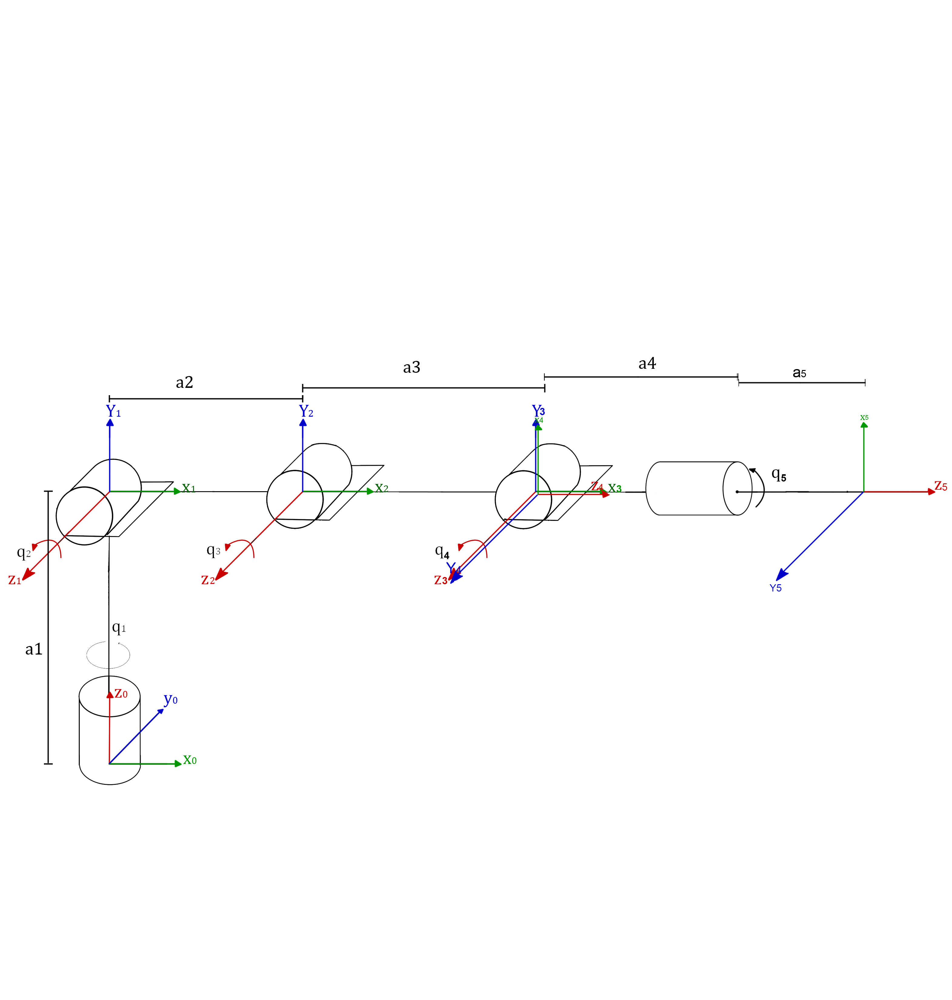

<!DOCTYPE html>
<html xmlns="http://www.w3.org/1999/xhtml" lang="" xml:lang="">
<head>
  <meta charset="utf-8" />
  <meta name="generator" content="pandoc" />
  <meta name="viewport" content="width=device-width, initial-scale=1.0, user-scalable=yes" />
  <meta name="author" content="" />
 
  <!--[if lt IE 9]>
    
  <![endif]-->
</head>
<body>
<header id="title-block-header">
<h1 class="title">Manipulator</h1>

</header>

<h1 id="kinematic-diagram">Kinematic diagram</h1>
<figure>
<figcaption>kinematics chain diagram.</figcaption>
</figure>

<h1 id="denavithartenberg-parameters">Denavit–Hartenberg parameters/caution this is for 4dof arm, haven't updated this yet</h1>

Below table with the parameters, Where <em>θ</em> is the rotation around Z, d is the translation in Z, a is the translation in X, and <em>α</em> is rotation around X 

<table>
<thead>
<tr class="header">
<th style="text-align: center;">i</th>
<th style="text-align: center;"><em>θ</em><em>i</em></th>
<th style="text-align: center;"><em>d</em><em>i</em></th>
<th style="text-align: center;"><em>a</em><em>i</em></th>
<th style="text-align: center;"><em>α</em><em>i</em></th>
</tr>
</thead>
<tbody>
<tr class="odd">
<td style="text-align: center;">1</td>
<td style="text-align: center;">q1</td>
<td style="text-align: center;">a1</td>
<td style="text-align: center;">0</td>
<td style="text-align: center;">90</td>
</tr>
<tr class="even">
<td style="text-align: center;">2</td>
<td style="text-align: center;">q2</td>
<td style="text-align: center;">0</td>
<td style="text-align: center;">a2</td>
<td style="text-align: center;">0</td>
</tr>
<tr class="odd">
<td style="text-align: center;">3</td>
<td style="text-align: center;">q3</td>
<td style="text-align: center;">0</td>
<td style="text-align: center;">0</td>
<td style="text-align: center;">90</td>
</tr>
<tr class="even">
<td style="text-align: center;">4</td>
<td style="text-align: center;">q4</td>
<td style="text-align: center;">0</td>
<td style="text-align: center;">a3+a4</td>
<td style="text-align: center;">0</td>
</tr>
</tbody>
</table>

Angles are in degrees and displacements in mm

<h1 id="Dependencies">Dependencies</h1>

  
 run these command in your terminal or command line, if you don't have   <a href="https://pip.pypa.io/en/stable/installing/">pip</a>, install it first.
  
 pip install numpy  
  
 pip install pandas  
  
 pip install plotly 
  
 pip install pyfirmata  
    
  
 Make sure to change "from tkinter import *" to "from Tkinter import * " if you are using windows.  

    
    
<h1 id="control">Control</h1>
<h2 id="manual-control">Manual control</h2>

1- using pyFirmata's Python interface for the Firmata protocol i managed to control the arduino with tkinter GUI and control each joint to get the desired position and orientation, or choose  specific point in space or even make incremental changes in the coordinates.(IK not working yet)  
  
  
  
<h1 id="electroni○s">electronics</h1>

 to spare myself the agony of connecting all these wires i made an arduino sheild for the servos 

 

<h1 id="Resources">Resources</h1>

[1] F. C. Park., K. M. Lynch INTRODUCTION TO ROBOTICS MECHANICS, PLANNING, AND CONTROL. 
[2] Sodemann, A. Robotics1. Retrieved from <a href="http://www.robogrok.com./Robotics_1.php">http://www.robogrok.com./Robotics_1.php</a>

</body>
</html>
